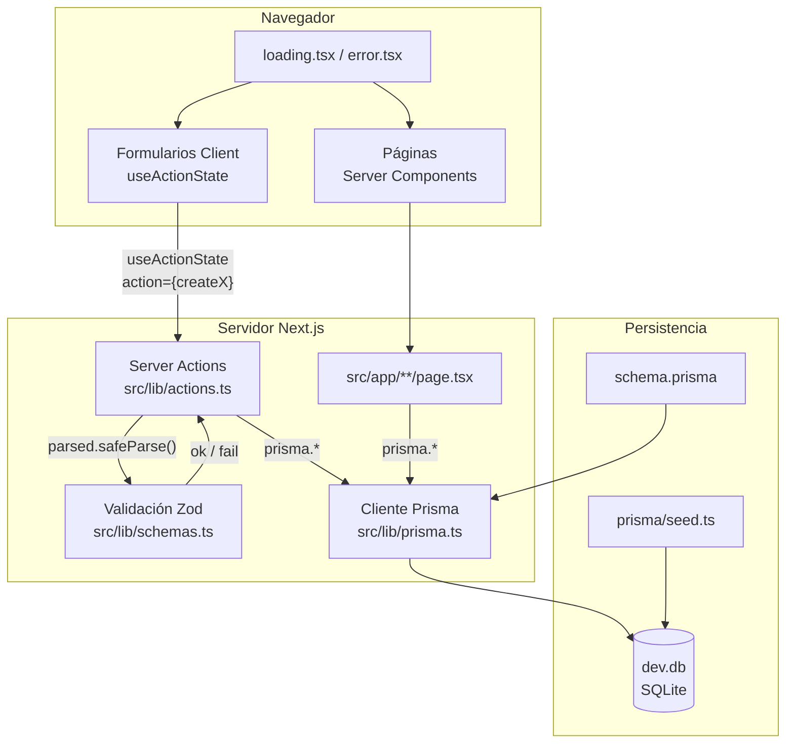
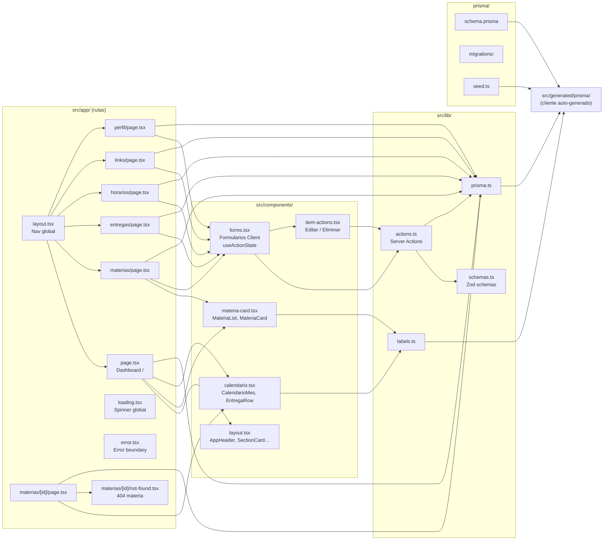
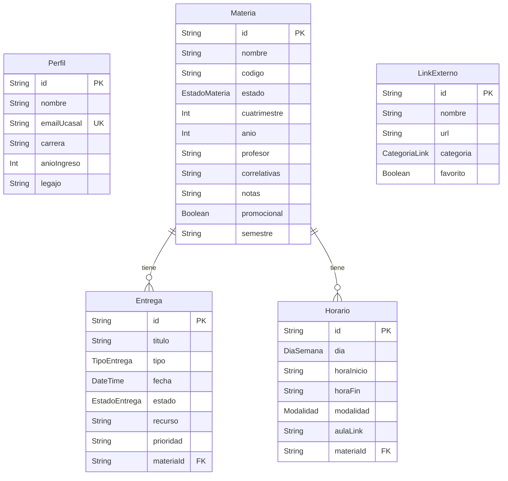
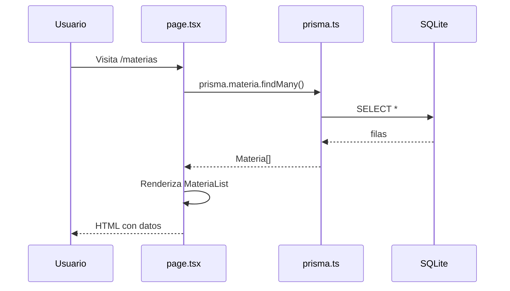
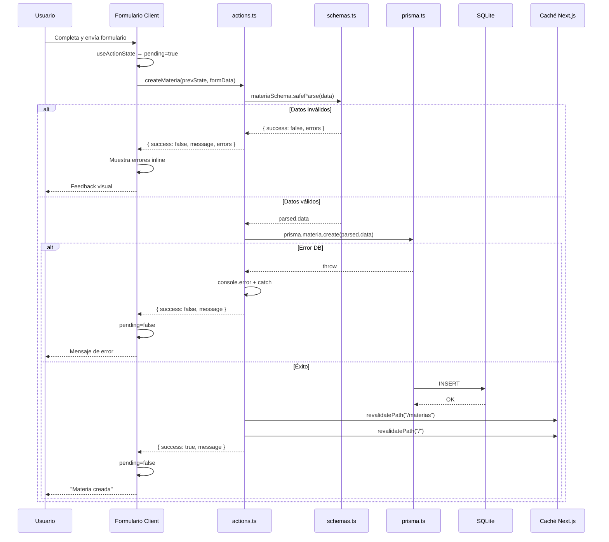
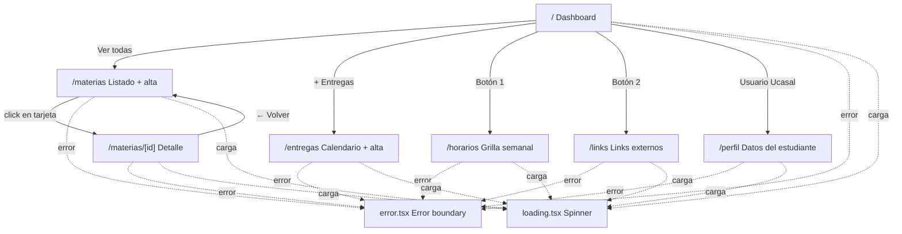

# UcaNode

Sistema de **autogestión** para estudiantes de **Ingeniería Informática** de la **Ucasal**.

Replica la estructura del dashboard personal en Notion, pero como aplicación web independiente con base de datos propia (SQLite).

---

## Tabla de contenidos

- [Funcionalidades](#funcionalidades)
- [Stack tecnológico](#stack-tecnológico)
- [Arquitectura general](#arquitectura-general)
- [Diagrama de archivos](#diagrama-de-archivos)
- [Modelo de datos](#modelo-de-datos)
- [Flujo de lectura y escritura](#flujo-de-lectura-y-escritura)
- [Rutas de la aplicación](#rutas-de-la-aplicación)
- [Instalación y desarrollo](#instalación-y-desarrollo)
- [Scripts útiles](#scripts-útiles)

---

## Funcionalidades

| Bloque del dashboard | Qué hace |
|---|---|
| **Materias Cursando** | Materias con estado `CURSANDO` |
| **Materias p/Finalizar / Regular / Finalizadas** | Resto de estados académicos |
| **Calendario** | TP, parciales y finales agrupados por fecha |
| **Botón 1 — Horarios** | Horario semanal personalizado por materia |
| **Botón 2 — Links** | Accesos a Drive, campus, GitHub, etc. |
| **Usuario Ucasal** | Perfil del estudiante |

---

## Stack tecnológico

| Capa | Tecnología |
|---|---|
| Framework | Next.js 16 (App Router) |
| UI | React 19 + Tailwind CSS 4 |
| ORM | Prisma 7 |
| Base de datos | SQLite (`dev.db`) |
| Validación | Zod |
| Fechas | date-fns |
| Iconos | lucide-react |

---

## Arquitectura general

UcaNode sigue el patrón **Server Components + Server Actions** de Next.js, con validación en servidor y feedback en cliente:

1. Las **páginas** (`src/app/**/page.tsx`) son Server Components: leen datos directamente con Prisma en el servidor. Cada ruta tiene su propio `loading.tsx` (spinner) y `error.tsx` (boundary con reintento).
2. Los **formularios** son componentes Client (`src/components/forms.tsx`) que usan `useActionState`: muestran pending state, errores de validación inline y mensajes de éxito/error.
3. Cada formulario invoca una **Server Action** (`src/lib/actions.ts`). Antes de tocar la DB, valida con **Zod** (`src/lib/schemas.ts`). Si falla la validación, devuelve errores por campo. Si hay un error inesperado, captura con try/catch y responde con mensaje amigable.
4. Las acciones usan **revalidación granular**: solo invalidan las rutas que realmente cambiaron (ej: `createEntrega` revalida `/`, `/entregas` y `/materias/[id]`).
5. Los **componentes** (`src/components/`) solo reciben props ya resueltas; no acceden a la base de datos.
6. **`src/lib/labels.ts`** centraliza las etiquetas y colores de los enums de Prisma.
7. **`prisma/schema.prisma`** define el modelo; el cliente generado vive en `src/generated/prisma/`.



---

## Diagrama de archivos

Relación entre carpetas y módulos del proyecto:



### Responsabilidad de cada archivo

| Archivo | Rol |
|---|---|
| `src/app/layout.tsx` | Layout raíz: fuentes, nav principal, estilos globales |
| `src/app/page.tsx` | Dashboard: materias por estado + calendario de entregas |
| `src/app/materias/page.tsx` | CRUD de materias (alta) + listado completo |
| `src/app/materias/[id]/page.tsx` | Detalle de una materia: entregas y horarios asociados |
| `src/app/entregas/page.tsx` | Alta de entregas + calendario + lista |
| `src/app/horarios/page.tsx` | Alta de horarios + grilla semanal por día |
| `src/app/links/page.tsx` | Alta y tarjetas de links externos |
| `src/app/perfil/page.tsx` | Formulario de perfil del estudiante |
| `src/app/loading.tsx` | Spinner de carga global |
| `src/app/error.tsx` | Error boundary con botón de reintento |
| `src/app/materias/[id]/not-found.tsx` | Página 404 para materia inexistente |
| `src/lib/actions.ts` | Server Actions: `createMateria`, `createEntrega`, `createHorario`, `createLink`, `updatePerfil`. Validan con Zod, devuelven `ActionResult`, revalidan granularmente. |
| `src/lib/schemas.ts` | Schemas Zod para cada entidad: validación de tipos, requeridos, rangos, formato URL/email |
| `src/lib/prisma.ts` | Singleton del cliente Prisma con adapter SQLite |
| `src/lib/labels.ts` | Mapas de enums → texto legible y clases CSS |
| `src/components/layout.tsx` | UI reutilizable: header del dashboard, tarjetas, estados vacíos |
| `src/components/materia-card.tsx` | Tarjetas clicables que llevan al detalle de materia |
| `src/components/calendario.tsx` | Vista de entregas agrupadas por fecha |
| `src/components/forms.tsx` | Formularios Client con `useActionState`: pending state, errores inline, feedback de éxito/error |
| `src/components/item-actions.tsx` | Botones de editar/eliminar inline con confirmación |
| `prisma/schema.prisma` | Definición de modelos y enums |
| `prisma/seed.ts` | Datos de ejemplo para desarrollo |

---

## Modelo de datos

Entidades y relaciones definidas en `prisma/schema.prisma`:



**Enums principales:**

- `EstadoMateria`: `CURSANDO`, `PARA_FINALIZAR`, `REGULAR`, `FINALIZADA`
- `TipoEntrega`: `TP`, `PARCIAL`, `FINAL`
- `EstadoEntrega`: `PENDIENTE`, `EN_CURSO`, `ENTREGADO`
- `DiaSemana`: `LUNES` … `VIERNES`
- `Modalidad`: `PRESENCIAL`, `VIRTUAL`
- `CategoriaLink`: `GOOGLE_DRIVE`, `PLATAFORMA_UCASAL`, `GITHUB`, `OTRO`

---

## Flujo de lectura y escritura

### Lectura (GET — Server Component)



### Escritura (POST — Server Action con validación)



Cada acción valida los datos con Zod antes de escribir. En caso de éxito, revalida solo las rutas afectadas y devuelve un mensaje. Los errores de validación se muestran por campo en el formulario.

---

## Rutas de la aplicación



| Ruta | Consultas Prisma | Acciones disponibles |
|---|---|---|
| `/` | `perfil`, `materia` (por estado), `entrega` + materia | — |
| `/materias` | `materia.findMany` | `createMateria` |
| `/materias/[id]` | `materia.findUnique` + entregas + horarios | — |
| `/entregas` | `entrega` + materia, `materia.findMany` | `createEntrega` |
| `/horarios` | `horario` + materia, `materia`, `perfil` | `createHorario` |
| `/links` | `linkExterno`, `perfil` | `createLink` |
| `/perfil` | `perfil.findFirst` | `updatePerfil` |

---

## Instalación y desarrollo

### Requisitos

- **Node.js 20.9+** (recomendado: **22**)
- npm

Este proyecto usa Next.js 16 y Prisma 7, que **no funcionan con Node 18**.

### Si tenés Node 18

```bash
export NVM_DIR="$HOME/.nvm"
[ -s "$NVM_DIR/nvm.sh" ] && . "$NVM_DIR/nvm.sh"

cd ~/Descargas/UcaNode
nvm use          # usa la versión del archivo .nvmrc (Node 22)
npm run dev
```

La primera vez:

```bash
nvm install 22
nvm alias default 22
node -v   # debe mostrar v22.x.x o v20.9+
```

### Setup inicial

```bash
npm install
npx prisma generate
npx prisma migrate dev
npm run db:seed
```

### Desarrollo

```bash
npm run dev
```

Abrí [http://localhost:3000](http://localhost:3000).

---

## Scripts útiles

| Comando | Descripción |
|---|---|
| `npm run dev` | Servidor de desarrollo |
| `npm run build` | Genera Prisma client + build de producción |
| `npm run start` | Servidor de producción |
| `npm run lint` | ESLint |
| `npm run db:migrate` | Aplicar migraciones |
| `npm run db:seed` | Cargar datos de ejemplo |
| `npm run db:reset` | Resetear DB + migraciones + seed |

---

## Relación con Notion

Notion fue la **referencia de diseño** para armar este programa. Los datos viven en SQLite (`dev.db`); **no se sincroniza con Notion**.

Para volver a datos de ejemplo:

```bash
npm run db:seed
```

---

## Estructura de carpetas (resumen)

```
UcaNode/
├── prisma/
│   ├── schema.prisma       # Modelo de datos
│   ├── seed.ts             # Datos de ejemplo
│   └── migrations/         # Migraciones SQL
├── src/
│   ├── app/                # Rutas (App Router)
│   │   ├── layout.tsx      # Layout + navegación
│   │   ├── page.tsx        # Dashboard
│   │   ├── loading.tsx     # Spinner global
│   │   ├── error.tsx       # Error boundary
│   │   ├── materias/
│   │   ├── entregas/
│   │   ├── horarios/
│   │   ├── links/
│   │   └── perfil/
│   ├── components/         # UI reutilizable
│   │   ├── layout.tsx      # AppHeader, SectionCard, EmptyState
│   │   ├── forms.tsx       # Formularios Client (useActionState)
│   │   ├── materia-card.tsx
│   │   ├── calendario.tsx
│   │   └── item-actions.tsx
│   ├── lib/
│   │   ├── prisma.ts       # Cliente Prisma singleton
│   │   ├── actions.ts      # Server Actions con validación Zod
│   │   ├── schemas.ts      # Schemas Zod
│   │   ├── labels.ts       # Mapas enum → texto
│   │   └── dates.ts        # Helpers de fecha
│   └── generated/prisma/   # Cliente Prisma (generado)
├── dev.db                  # Base SQLite (local)
├── package.json
└── zod                     # Validación de schemas
```
