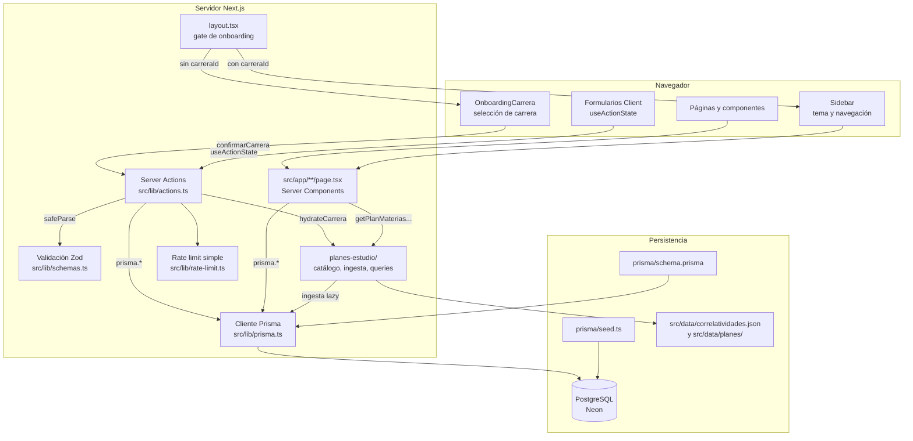

# Arquitectura

UcaNode sigue el patrón de Next.js App Router con Server Components para lectura y Server Actions para escritura.

## Capas

| Capa | Responsabilidad |
|---|---|
| `src/app/` | Rutas, layouts, páginas server, loading states y error boundaries |
| `src/components/` | Componentes de UI reutilizables y formularios client |
| `src/lib/actions.ts` | Server Actions para crear, editar o eliminar datos |
| `src/lib/schemas.ts` | Validación de entrada con Zod |
| `src/lib/perfil.ts` | Obtiene o crea el perfil del estudiante |
| `src/lib/planes-estudio/` | Catálogo, fuente JSON, ingesta lazy y consultas del plan |
| `src/lib/prisma.ts` | Singleton del cliente Prisma |
| `prisma/schema.prisma` | Modelo de datos, enums, relaciones e índices |
| `src/generated/prisma/` | Cliente Prisma generado |

## Flujo general

## Onboarding y plan de estudios

El layout raíz (`src/app/layout.tsx`) actúa como gate:

1. `getOrCreatePerfil()` obtiene o crea el perfil del estudiante.
2. Si `perfil.carreraId` es `null`, renderiza solo `OnboardingCarrera` (sin sidebar ni rutas internas).
3. El usuario elige una carrera del catálogo y confirma con `confirmarCarrera`.
4. La acción llama a `hydrateCarrera(slug)` en `src/lib/planes-estudio/ingesta.ts`, que carga el JSON a tablas `Carrera`, `PlanEstudio` y `CorrelatividadPlan` si aún no existen.
5. Se actualiza `Perfil.carreraId` y la app pasa al layout habitual con sidebar.

La ingesta es idempotente: si la carrera ya está en DB con `estadoIngesta = LISTO`, no se vuelve a cargar.

Carreras no disponibles en el catálogo pueden solicitarse vía un Google Form configurado con `NEXT_PUBLIC_CARRERA_SOLICITUD_FORM_URL`.

## Lectura de datos

Las páginas de `src/app/**/page.tsx` son Server Components. Consultan Prisma directamente, reciben datos ya resueltos y renderizan HTML en servidor.

El plan de estudios para autocompletado se lee desde DB (`getPlanMateriasByCarreraId`) una vez completado el onboarding. El JSON en `src/data/` es la fuente de verdad para la ingesta, no para lectura en runtime.

## Escritura de datos

Los formularios viven en `src/components/forms.tsx` y usan `useActionState` para manejar estado pendiente, errores por campo y mensajes de éxito.

Cada Server Action:

1. Aplica rate limit básico por IP.
2. Normaliza valores del `FormData`.
3. Valida con Zod.
4. Ejecuta la operación Prisma.
5. Revalida las rutas afectadas con `revalidatePath`.
6. Devuelve un `ActionResult` consistente para la UI.

## Revalidación

La revalidación busca ser granular. Por ejemplo, al modificar materias se revalidan el dashboard, el listado de materias y, cuando corresponde, el detalle de la materia afectada. Confirmar carrera revalida toda la app (`revalidateApp`).

## Estado de UI

El layout raíz obtiene el perfil y preferencias persistidas en cookies. Con carrera asignada, la sidebar controla:

- Navegación principal.
- Link al perfil.
- Colapso en desktop.
- Apertura móvil.
- Tema claro/oscuro.
