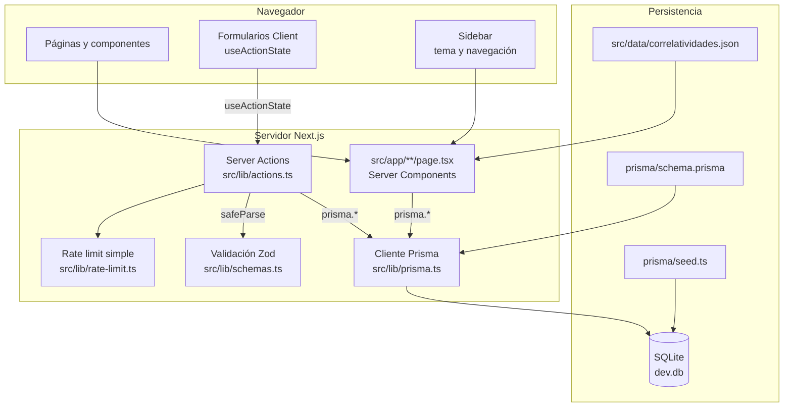

# Arquitectura

UcaNode sigue el patrón de Next.js App Router con Server Components para lectura y Server Actions para escritura.

## Capas

| Capa | Responsabilidad |
|---|---|
| `src/app/` | Rutas, layouts, páginas server, loading states y error boundaries |
| `src/components/` | Componentes de UI reutilizables y formularios client |
| `src/lib/actions.ts` | Server Actions para crear, editar o eliminar datos |
| `src/lib/schemas.ts` | Validación de entrada con Zod |
| `src/lib/prisma.ts` | Singleton del cliente Prisma |
| `prisma/schema.prisma` | Modelo de datos, enums, relaciones e índices |
| `src/generated/prisma/` | Cliente Prisma generado |

## Flujo general

## Lectura de datos

Las páginas de `src/app/**/page.tsx` son Server Components. Consultan Prisma directamente, reciben datos ya resueltos y renderizan HTML en servidor.

Esto mantiene la base de datos fuera de los componentes de UI. Los componentes reciben props y no abren conexiones por su cuenta.

## Escritura de datos

Los formularios viven en `src/components/forms.tsx` y usan `useActionState` para manejar estado pendiente, errores por campo y mensajes de éxito.

Cada Server Action:

1. Aplica rate limit básico por IP.
2. Normaliza valores del `FormData`.
3. Valida con Zod.
4. Ejecuta la operación Prisma.
5. Revalida las rutas afectadas con `revalidatePath`.
6. Devuelve un `ActionResult` consistente para la UI.

## Revalidación

La revalidación busca ser granular. Por ejemplo, al modificar materias se revalidan el dashboard, el listado de materias y, cuando corresponde, el detalle de la materia afectada.

## Estado de UI

El layout raíz obtiene el perfil y preferencias persistidas en cookies. La sidebar controla:

- Navegación principal.
- Link al perfil.
- Colapso en desktop.
- Apertura móvil.
- Tema claro/oscuro.
