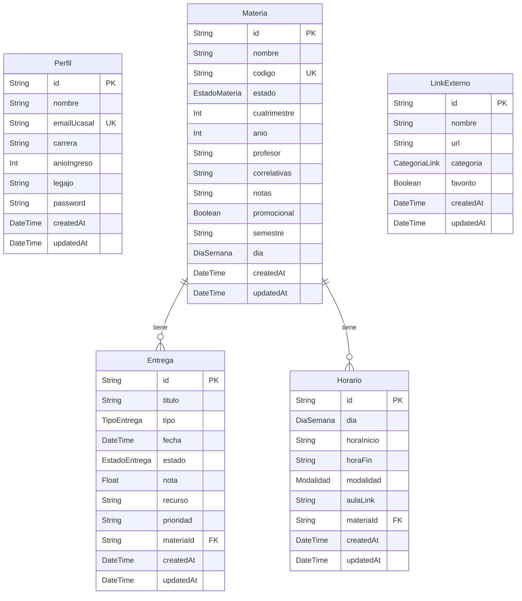

# Modelo de datos

El modelo está definido en `prisma/schema.prisma`. La base de datos local usa SQLite y Prisma genera el cliente en `src/generated/prisma/`.

## Diagrama

## Entidades

| Entidad | Uso |
|---|---|
| `Perfil` | Datos del estudiante. Actualmente se consulta el primer perfil disponible. |
| `Materia` | Materias del usuario, estado académico y metadatos de cursada. |
| `Entrega` | TP, parciales y finales asociados a una materia. |
| `Horario` | Bloques semanales asociados a una materia. |
| `LinkExterno` | Accesos frecuentes, con categoría y marca de favorito. |

## Enums

| Enum | Valores |
|---|---|
| `EstadoMateria` | `CURSANDO`, `PARA_FINALIZAR`, `REGULAR`, `FINALIZADA` |
| `TipoEntrega` | `TP`, `PARCIAL`, `FINAL` |
| `EstadoEntrega` | `PENDIENTE`, `EN_CURSO`, `ENTREGADO` |

> `Entrega.nota` es un campo opcional (`Float`, 0–10) que solo aplica a entregas de tipo `PARCIAL`. Se carga desde la edición de la entrega cuando el estudiante recibe la calificación; si el tipo deja de ser `PARCIAL`, la nota se descarta.
| `CategoriaLink` | `GOOGLE_DRIVE`, `PLATAFORMA_UCASAL`, `GITHUB`, `OTRO` |
| `Modalidad` | `PRESENCIAL`, `VIRTUAL` |
| `DiaSemana` | `LUNES`, `MARTES`, `MIERCOLES`, `JUEVES`, `VIERNES` |

## Relaciones

- `Materia` tiene muchas `Entrega`.
- `Materia` tiene muchos `Horario`.
- Si se elimina una `Materia`, sus entregas y horarios se eliminan en cascada.

## Índices y constraints

- `Perfil.emailUcasal` es único.
- `Materia.codigo` es único cuando existe.
- `Materia` tiene índices por `estado` y `nombre`.
- `Entrega` tiene índices por `fecha`, `materiaId` y `estado`.

## Correlatividades

La información del plan de estudio vive separada del modelo Prisma:

- Datos base: `src/data/correlatividades.json`.
- Helpers de búsqueda y formateo: `src/lib/correlatividades.ts`.
- Tests: `src/lib/__tests__/correlatividades.test.ts`.

Esta separación permite usar correlatividades para autocompletar o mostrar contexto sin convertir todo el plan de estudio en tablas de la base de datos.
