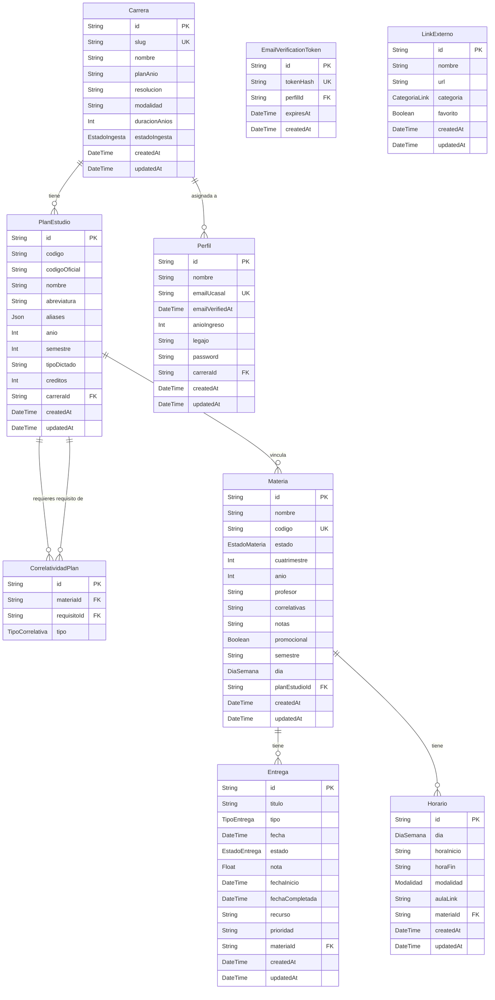

# Modelo de datos

El modelo está definido en `prisma/schema.prisma`. La base usa PostgreSQL (Neon en producción) y Prisma genera el cliente en `src/generated/prisma/`.

## Diagrama



## Entidades

| Entidad | Uso |
|---|---|
| `Carrera` | Carrera UCASAL disponible en onboarding. Se identifica por `slug` y guarda metadatos del plan. |
| `PlanEstudio` | Materias del plan oficial de una carrera (código, año, semestre, aliases). |
| `CorrelatividadPlan` | Requisitos entre materias del plan (`REGULARIZADA`, `APROBADA`, `PARA_RENDIR`). |
| `Perfil` | Datos del estudiante. Puede ser invitado (sin email/contraseña) o cuenta registrada con email verificado (`emailVerifiedAt`). La carrera se asigna en onboarding vía `carreraId`. |
| `EmailVerificationToken` | Token de un solo uso (hash en DB) para confirmar el email tras registro o cambio de dirección. Expira a las 24 h. |
| `Materia` | Materias del usuario, estado académico y metadatos de cursada. Puede vincularse opcionalmente a `PlanEstudio`. |
| `Entrega` | TP, parciales y finales asociados a una materia. |
| `Horario` | Bloques semanales asociados a una materia. |
| `LinkExterno` | Accesos frecuentes, con categoría y marca de favorito. |

## Enums

| Enum | Valores |
|---|---|
| `EstadoMateria` | `CURSANDO`, `PARA_FINALIZAR`, `REGULAR`, `FINALIZADA` |
| `TipoEntrega` | `TP`, `PARCIAL`, `FINAL` |
| `EstadoEntrega` | `PENDIENTE`, `EN_CURSO`, `ENTREGADO` |
| `CategoriaLink` | `GOOGLE_DRIVE`, `PLATAFORMA_UCASAL`, `GITHUB`, `OTRO` |
| `Modalidad` | `PRESENCIAL`, `VIRTUAL` |
| `DiaSemana` | `LUNES`, `MARTES`, `MIERCOLES`, `JUEVES`, `VIERNES` |
| `TipoCorrelativa` | `REGULARIZADA`, `APROBADA`, `PARA_RENDIR` |
| `EstadoIngesta` | `PENDIENTE`, `LISTO`, `ERROR` |

> `Entrega.nota` es un campo opcional (`Float`, 0–10) que aplica a entregas de tipo `PARCIAL` y `FINAL`. Se carga desde la creación o edición de la entrega cuando el estudiante recibe la calificación; si el tipo deja de ser evaluable (`TP`), la nota se descarta.

> `Entrega.fechaInicio` se registra la primera vez que la entrega pasa a `EN_CURSO`. `Entrega.fechaCompletada` se registra al marcar `ENTREGADO`. Si se revierte el estado, esos timestamps se limpian según las reglas de transición.

## Relaciones

- `Carrera` tiene muchas `PlanEstudio` y muchos `Perfil`.
- `PlanEstudio` tiene correlatividades bidireccionales vía `CorrelatividadPlan`.
- `Materia` puede vincularse opcionalmente a una fila de `PlanEstudio` (`planEstudioId`).
- `Materia` tiene muchas `Entrega` y muchos `Horario`.
- Si se elimina una `Materia`, sus entregas y horarios se eliminan en cascada.
- Si se elimina una `Carrera`, sus filas de `PlanEstudio` se eliminan en cascada.

## Índices y constraints

- `Carrera.slug` es único.
- `Perfil.emailUcasal` es único.
- `EmailVerificationToken.tokenHash` es único.
- `PlanEstudio` tiene `@@unique([carreraId, codigo])`.
- `CorrelatividadPlan` tiene `@@unique([materiaId, requisitoId, tipo])`.
- `Materia.codigo` es único cuando existe.
- `Materia` tiene índices por `estado` y `nombre`.
- `Entrega` tiene índices por `fecha`, `materiaId` y `estado`.

## Plan de estudios y correlatividades

El plan oficial vive en JSON versionado y se ingesta a la base de datos de forma lazy al confirmar la carrera en onboarding.

| Capa | Ubicación | Rol |
|---|---|---|
| Fuente JSON | `src/data/correlatividades.json` (Informática 2015); otras carreras en `src/data/planes/{slug}.json` (p. ej. `ingenieria-civil-2012.json`) | Datos canónicos del plan |
| Catálogo | `src/lib/planes-estudio/catalogo.ts` | Carreras visibles en onboarding |
| Fuente | `src/lib/planes-estudio/fuente.ts` | Mapa `slug` → JSON |
| Ingesta | `src/lib/planes-estudio/ingesta.ts` | Carga lazy a `Carrera`, `PlanEstudio` y `CorrelatividadPlan` |
| Consultas | `src/lib/planes-estudio/queries.ts` | Lee el plan desde DB para autocompletado en runtime |
| Helpers | `src/lib/correlatividades.ts` | Búsqueda y formateo (tests y compatibilidad con JSON) |

Flujo resumido:

1. El usuario elige una carrera en onboarding (`confirmarCarrera`).
2. `hydrateCarrera` ingesta el JSON si la carrera aún no está en DB.
3. Se asigna `Perfil.carreraId`.
4. Pantallas como `/materias` consultan el plan desde DB vía `getPlanMateriasByCarreraId`.

Para validar un JSON de plan antes de incorporarlo:

```bash
npm run validate:plan -- src/data/correlatividades.json
```

Para agregar carreras nuevas, usar el agente `.cursor/agents/plan-estudio-ingesta.md`.
