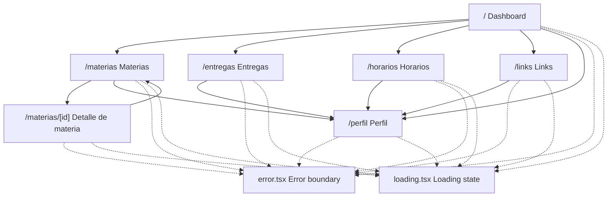
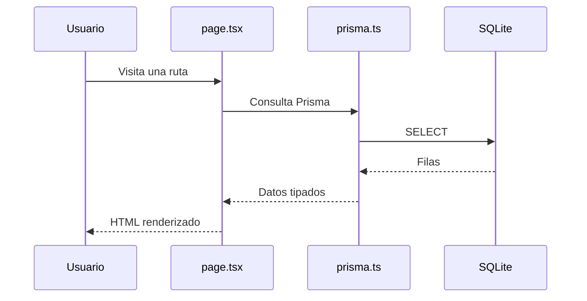
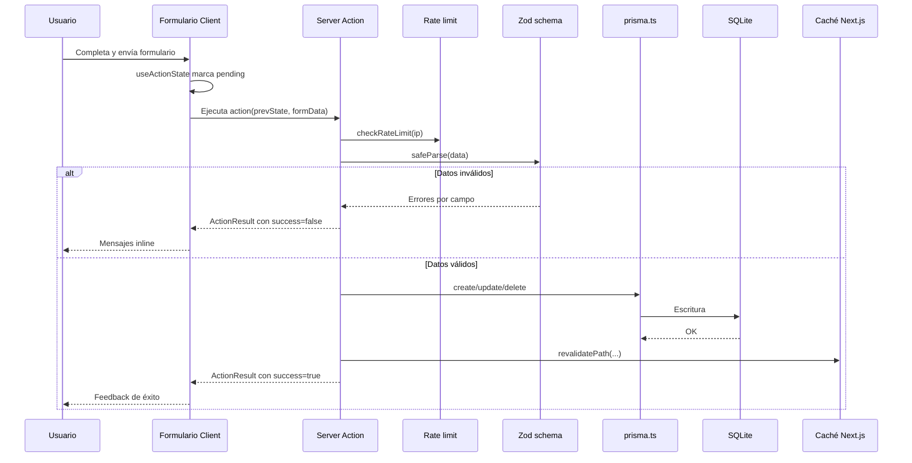

# Rutas y flujos

Esta página resume la navegación principal y cómo se leen/escriben datos en cada pantalla.

## Navegación

La sidebar incluye accesos a dashboard, materias, entregas, horarios, links y perfil. También maneja el modo claro/oscuro y el colapso en pantallas grandes.

## Rutas

| Ruta | Lecturas principales | Acciones disponibles |
|---|---|---|
| `/` | Entregas, materias cursando, horarios y links favoritos | - |
| `/materias` | `materia.findMany` (catálogo en tarjetas con año/semestre) | `createMateria`, `updateMateria`, `deleteMateria` |
| `/materias/[id]` | `materia.findUnique` con entregas y horarios | Acciones sobre items relacionados según componentes reutilizados |
| `/entregas` | `entrega.findMany`, `materia.findMany` | `createEntrega`, `updateEntrega`, `deleteEntrega` |
| `/horarios` | `horario.findMany` y `materia.findMany` filtrados a estados activos (`CURSANDO`, `PARA_FINALIZAR`) | `createHorario`, `updateHorario`, `deleteHorario` |
| `/links` | `linkExterno.findMany`, perfil | `createLink`, `updateLink`, `deleteLink` |
| `/perfil` | `perfil.findFirst` | `updatePerfil` |

## Flujo de lectura

Las consultas viven en las páginas de `src/app/`. Los componentes de `src/components/` renderizan datos ya cargados.

## Flujo de escritura

## Manejo de errores

- Errores de validación: vuelven al formulario como `errors`.
- Errores inesperados: se capturan en las acciones y devuelven un mensaje amigable.
- Errores de renderizado: caen en `src/app/error.tsx`.
- Rutas no encontradas: usan `src/app/not-found.tsx` o `src/app/materias/[id]/not-found.tsx`.

## Revalidación por dominio

- Materias: dashboard, listado y detalle cuando aplica.
- Entregas: dashboard, entregas y detalle de materia.
- Horarios: dashboard, horarios y detalle de materia.
- Links: dashboard y links.
- Perfil: layout/rutas que muestran datos del perfil.
