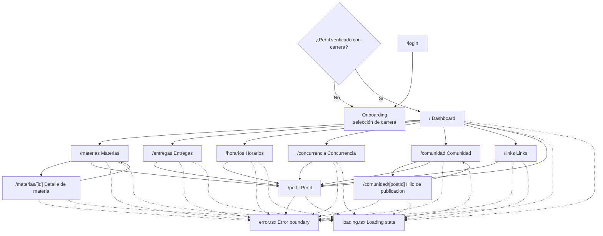
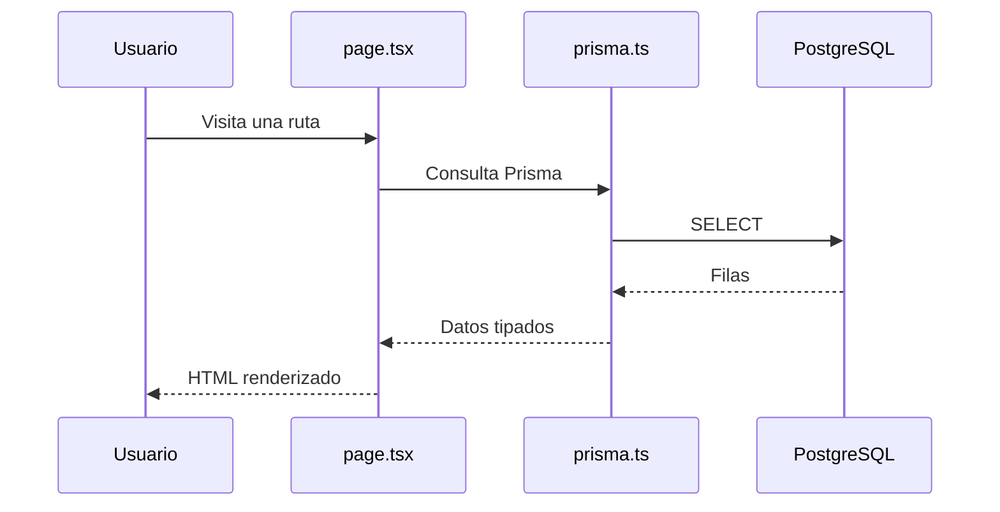
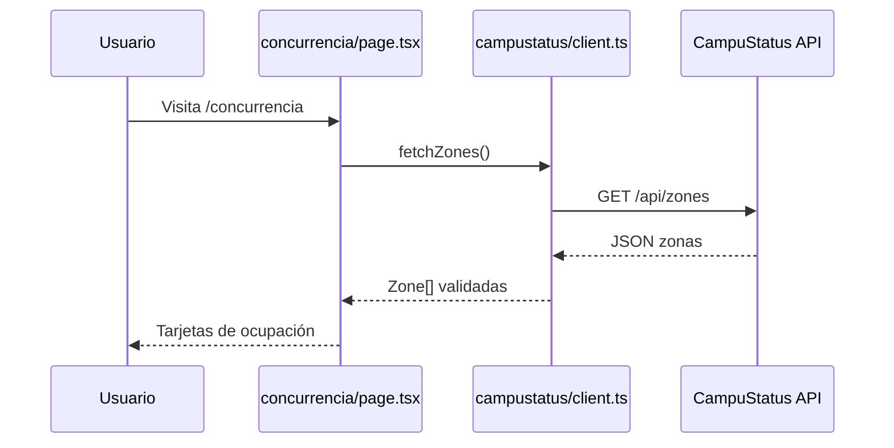
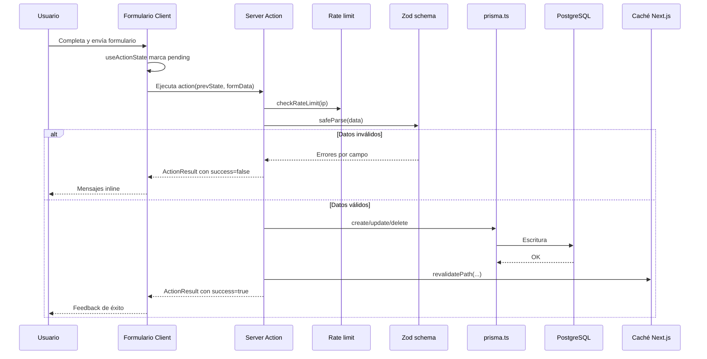

# Rutas y flujos

Esta página resume la navegación principal y cómo se leen/escriben datos en cada pantalla.

## Gate de acceso y onboarding

El layout raíz aplica varios gates en orden:

1. **Ruta de marketing pública** (`/` o `/u/...`) → sin cookie ni sidebar; `/u/[slug]` activa redirige a `/`.
2. **Sin cookie** → el middleware redirige a `/login?next=...`.
3. **Perfil `fantasma`** (invitados legacy) → cartel amigable pidiendo crear cuenta o iniciar sesión (`FantasmaGate`). Al registrarse se adopta el perfil y se conservan los datos.
4. **Email pendiente de verificación** → redirect a `/verificar-email`.
5. **Sin cuenta verificada** → redirect a `/login`.
6. **Sin `carreraId`** → onboarding (`OnboardingCarrera`) a pantalla completa, sin sidebar.
7. **Con carrera** → layout habitual con sidebar.

La acción `confirmarCarrera` exige cuenta verificada, asigna la carrera, dispara la ingesta lazy del plan y revalida toda la aplicación.

## Navegación

```mermaid
flowchart TD
    Gate{"¿Perfil verificado con carrera?"}
    Login["/login"]
    Onb["Onboarding<br/>selección de carrera"]
    Root["/ Dashboard"]
    Mat["/materias Materias"]
    MatId["/materias/[id] Detalle de materia"]
    Ent["/entregas Entregas"]
    Hor["/horarios Horarios"]
    Con["/concurrencia Concurrencia"]
    Com["/comunidad Comunidad"]
    ComId["/comunidad/[postId] Hilo de publicación"]
    Lnk["/links Links"]
    Per["/perfil Perfil"]
    Err["error.tsx Error boundary"]
    Ld["loading.tsx Loading state"]

    Gate -->|No| Onb
    Gate -->|Sí| Root
    Login --> Onb
    Root --> Mat
    Root --> Ent
    Root --> Hor
    Root --> Con
    Root --> Com
    Com --> ComId
    ComId --> Com
    Root --> Lnk
    Mat --> MatId
    MatId --> Mat
    Root --> Per
    Mat --> Per
    Ent --> Per
    Hor --> Per
    Con --> Per
    Com --> Per
    Lnk --> Per

    Root & Mat & MatId & Ent & Hor & Con & Com & ComId & Lnk & Per -.-> Err
    Root & Mat & MatId & Ent & Hor & Con & Com & ComId & Lnk & Per -.-> Ld
```

La sidebar incluye accesos a dashboard, materias, entregas, horarios, concurrencia, comunidad, links y perfil. Solo es visible después de completar el onboarding. También maneja el modo claro/oscuro y el colapso en pantallas grandes.

## Rutas

| Ruta | Lecturas principales | Acciones disponibles |
|---|---|---|
| `/` | Landing pública UCASAL | - |
| `/u/[slug]` | Catálogo `src/lib/universidades/` (estado + novedades) | Redirect a `/` si la universidad está `activa` |
| Onboarding (layout) | `requirePerfil`, `listCarrerasDisponibles` | `confirmarCarrera` (requiere email verificado) |
| `/materias` | `materia.findMany`, `getPlanMateriasByCarreraId` (autocompletado) | `createMateria`, `updateMateria`, `deleteMateria` |
| `/materias/[id]` | `materia.findUnique` con entregas y horarios | Acciones sobre items relacionados según componentes reutilizados |
| `/entregas` | `entrega.findMany`, `materia.findMany` | `createEntrega`, `updateEntrega`, `deleteEntrega`, `obtenerNotasEntrega`, `guardarNotasEntrega` |
| `/horarios` | `horario.findMany` y `materia.findMany` filtrados a estados activos (`CURSANDO`, `PARA_FINALIZAR`) | `createHorario`, `updateHorario`, `deleteHorario` |
| `/concurrencia` | `fetchZones` desde CampuStatus (`GET /api/zones`, cache 60 s) | - |
| `/comunidad` | `getPosts`, `getCommunitySidebarData`, perfil, materias `CURSANDO`, plan de estudio | `createPost`, `votePost` |
| `/comunidad/[postId]` | `getPostById`, comentarios anidados | `createComment`, `votePost`, `voteComment` |
| `/links` | `linkExterno.findMany`, perfil | `createLink`, `updateLink`, `deleteLink` |
| `/perfil` | `perfil.findFirst` con `carrera` | `updatePerfil` (carrera de solo lectura, definida en onboarding) |

## Universidades

El listado vive en `src/lib/universidades/catalogo.ts` (sin tabla Prisma). Cada entrada tiene `estado` (`activa` | `en_construccion`) y `novedades`. Las carreras del onboarding llevan `universidadSlug` en `CarreraCatalogo`. Para sumar otra universidad: agregar el objeto al catálogo; `/u/{slug}` aparece sola. Cuando haya planes, cambiar `estado` a `activa` y filtrar onboarding por `universidadSlug`.

## Comunidad (foro estudiantil)

Lógica en `src/lib/community/`:

| Módulo | Rol |
|---|---|
| `queries.ts` | `getPosts`, `getPostById`, `getCommunitySidebarData` |
| `actions.ts` | `createPost`, `createComment`, `votePost`, `voteComment` |
| `mappers.ts` | Prisma → DTOs (`CommunityPost`, `CommunityComment`) |
| `comment-tree.ts` | Comentarios planos → árbol anidado |
| `schemas.ts` | Validación Zod de entradas |

Flujo resumido:

1. `/comunidad` carga posts desde PostgreSQL y sidebar (top recursos + tendencias).
2. Filtros por pestaña y búsqueda se aplican en cliente sobre el feed inicial.
3. **Nuevo post** → `createPost` (título, contenido, materia del plan, adjuntos URL).
4. **Detalle** `/comunidad/[postId]` → comentarios anidados + votos optimistas.
5. Perfiles `fantasma` no pueden escribir hasta completar registro.

## Auth y verificación de email

Rutas públicas (sin gate de carrera ni cookie obligatoria para la pantalla):

| Ruta / API | Rol |
|---|---|
| `/` | Landing de marketing (UCASAL) |
| `/u/[slug]` | Hub de universidad: en construcción + novedades, o redirect si está activa |
| `/login`, `/registro` | Formularios de acceso; login muestra carreras disponibles |
| `/verificar-email` | Post-registro, reenvío de mail y botón Continuar |
| `POST /api/auth/login` | Valida credenciales; bloquea si el email no está verificado |
| `POST /api/auth/registro` | Crea cuenta pendiente, setea cookie y envía mail |
| `GET /api/auth/verificar?token=...` | Confirma el email, setea cookie y redirige a la app |
| `GET /api/auth/estado-verificacion` | Consulta si el email ya fue verificado (DB) |
| `POST /api/auth/continuar-verificacion` | Continúa tras verificar sin salir de la plataforma |
| `POST /api/auth/reenviar-verificacion` | Reenvía el mail (cooldown 1 min) |
| `/recuperar-contrasena` | Solicita enlace para restablecer contraseña (sin sesión) |
| `/cambiar-contrasena?token=...` | Formulario para nueva contraseña (token por email, TTL 1 h) |
| `/cambiar-email?token=...` | Confirma cambio de email solicitado desde `/perfil` (TTL 24 h) |

Flujo resumido:

1. Visita sin cookie → `/login` (con listado de carreras).
2. Registro → cookie + `/verificar-email`.
3. Click en el link del mail o botón Continuar → `emailVerifiedAt` + sesión activa.
4. Onboarding de carrera (solo con cuenta verificada).
5. Login solo permitido con email verificado.
6. **Cambio de contraseña** en `/perfil` > Seguridad: mail con link a `/cambiar-contrasena`. También disponible desde `/recuperar-contrasena` (olvidé mi contraseña). Al aplicar el cambio se incrementa `sessionVersion` y se invalidan sesiones en otros dispositivos.
7. **Cambio de email** en `/perfil` > Seguridad: mail al email actual con link a `/cambiar-email`; al confirmar se invalida la verificación y se envía mail al nuevo email.

En desarrollo, si `RESEND_API_KEY` no está configurada, el link de verificación se imprime en la consola del servidor.

En producción (`https://ucanode.app`), los mails salen desde `noreply@mail.ucanode.app` y los links usan `APP_URL`.

## Flujo de lectura

```mermaid
sequenceDiagram
    participant U as Usuario
    participant P as page.tsx
    participant Pr as prisma.ts
    participant DB as PostgreSQL

    U->>P: Visita una ruta
    P->>Pr: Consulta Prisma
    Pr->>DB: SELECT
    DB-->>Pr: Filas
    Pr-->>P: Datos tipados
    P-->>U: HTML renderizado
```

Las consultas viven en las páginas de `src/app/`. Los componentes de `src/components/` renderizan datos ya cargados.

### Lectura externa (CampuStatus)

`/concurrencia` no usa Prisma: la página llama a `fetchZones()` en `src/lib/campustatus/client.ts`, que consulta la API pública de CampuStatus desde el servidor (sin CORS en el browser). La respuesta se valida con Zod y se cachea 60 segundos con `next.revalidate`. El botón **Actualizar** fuerza un nuevo fetch vía `router.refresh()`.

```mermaid
sequenceDiagram
    participant U as Usuario
    participant P as concurrencia/page.tsx
    participant S as campustatus/client.ts
    participant API as CampuStatus API

    U->>P: Visita /concurrencia
    P->>S: fetchZones()
    S->>API: GET /api/zones
    API-->>S: JSON zonas
    S-->>P: Zone[] validadas
    P-->>U: Tarjetas de ocupación
```

## Flujo de escritura

```mermaid
sequenceDiagram
    participant U as Usuario
    participant F as Formulario Client
    participant A as Server Action
    participant R as Rate limit
    participant S as Zod schema
    participant Pr as prisma.ts
    participant DB as PostgreSQL
    participant C as Caché Next.js

    U->>F: Completa y envía formulario
    F->>F: useActionState marca pending
    F->>A: Ejecuta action(prevState, formData)
    A->>R: checkRateLimit(ip)
    A->>S: safeParse(data)
    alt Datos inválidos
        S-->>A: Errores por campo
        A-->>F: ActionResult con success=false
        F-->>U: Mensajes inline
    else Datos válidos
        A->>Pr: create/update/delete
        Pr->>DB: Escritura
        DB-->>Pr: OK
        A->>C: revalidatePath(...)
        A-->>F: ActionResult con success=true
        F-->>U: Feedback de éxito
    end
```

## Manejo de errores

- Errores de validación: vuelven al formulario como `errors`.
- Errores inesperados: se capturan en las acciones y devuelven un mensaje amigable.
- Errores de renderizado: caen en `src/app/error.tsx`.
- Rutas no encontradas: usan `src/app/not-found.tsx` o `src/app/materias/[id]/not-found.tsx`.

## Revalidación por dominio

- Onboarding / carrera: toda la app (`revalidateApp`).
- Materias: dashboard, listado y detalle cuando aplica.
- Entregas: dashboard, entregas y detalle de materia. Los apuntes (`guardarNotasEntrega`) se persisten sin `revalidatePath` para no remountar el editor.
- Horarios: dashboard, horarios y detalle de materia.
- Links: dashboard y links.
- Perfil: layout/rutas que muestran datos del perfil.
